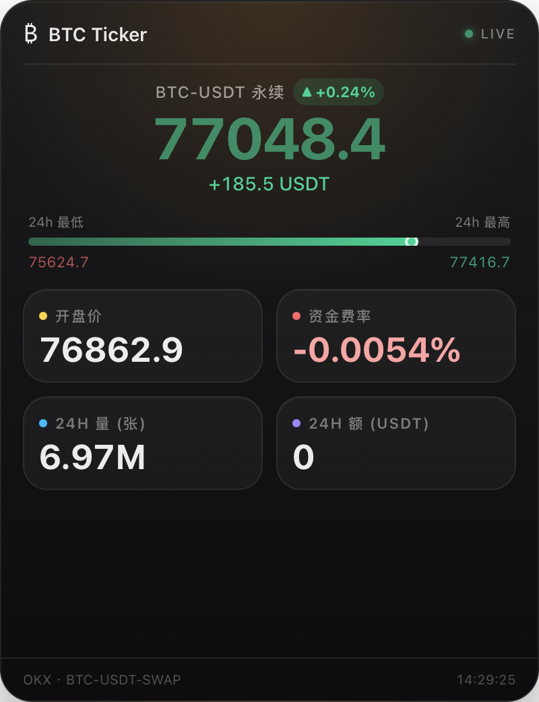
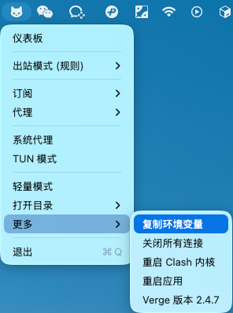

# BTC Ticker


> 一个轻量级的 macOS 状态栏比特币行情监控工具，实时显示 BTC 价格，支持 K 线图表预览。

## ✨ 功能特性

- 📊 **实时行情** - 通过 OKX WebSocket 实时推送 BTC/USDT 价格数据
- 🖥️ **系统托盘** - 常驻 macOS 状态栏，不占用 Dock 空间，随时查看
- 📈 **迷你图表** - 简洁的价格走势迷你图（开发中）
- 🎨 **原生体验** - 基于 Tauri 2 + Vue 3 + Nuxt 4 构建，极致轻量
- ⚡ **低资源占用** - Rust 后端 + 现代前端技术栈，性能卓越

## 📸 界面预览

### 状态栏显示


### 行情详情窗口



> 💡 **提示**: K 线走势图功能正在开发中，后续版本将会支持。

## 🚀 快速开始

### 系统要求

- **macOS**: 10.15 (Catalina) 或更高版本
- **Node.js**: 18+ 
- **Rust**: 1.70+
- **pnpm**: 8+

### 安装使用

#### 方式一：直接下载（推荐）

1. 前往 [Releases](https://github.com/jiswordsman/btc-ticker/releases) 页面

2. 下载最新版本的 `.dmg` 安装包

3. 双击安装，将 `BTC Ticker.app` 拖入 Applications 文件夹

4. 启动应用，状态栏即会显示 BTC 实时价格

5. 如果提示应用已损坏，在终端执行 `sudo xattr -r -d com.apple.quarantine /Applications/BTC\ Ticker.app/`

6. 首次使用需要配置代理，在状态栏点击右键，选择【代理】，在弹出窗口中进行配置。

   > 由于在国内 Okx API 需要开启 VPN 才能使用，所以必须配置代理。如果没有代理，可以使用 [【一分机场】](https://xn--4gqx1hgtfdmt.com/#/register?code=5obSssIm)（每月两元），安装之后参考截图获取代理端口
   >
   > 

#### 方式二：从源码构建

```bash
# 1. 克隆仓库
git clone https://github.com/jiswordsman/btc-ticker.git
cd btc-ticker

# 2. 安装依赖
pnpm install

# 3. 构建应用
pnpm tauri build
```

构建完成后，产物位于：
```
src-tauri/target/release/bundle/
├── macos/BTC Ticker.app
└── dmg/BTC Ticker_0.1.0_aarch64.dmg
```

## 💻 本地开发

### 环境准备

```bash
# 安装 Rust（如果尚未安装）
curl --proto '=https' --tlsv1.2 -sSf https://sh.rustup.rs | sh

# 安装 Node.js 依赖管理工具 pnpm
npm install -g pnpm
```

### 开发模式

```bash
# 1. 克隆仓库
git clone https://github.com/jiswordsman/btc-ticker.git
cd btc-ticker

# 2. 安装依赖
pnpm install

# 3. 启动开发模式
pnpm tauri dev
```

> **提示**: `pnpm tauri dev` 会自动构建 Nuxt 前端并启动 Tauri 桌面应用。开发模式下，应用会连接真实的 OKX WebSocket 获取实时数据。

### 仅开发前端（浏览器预览）

如果你只需要调试前端 UI，可以单独启动 Nuxt 开发服务器：

```bash
pnpm dev
```

然后在浏览器访问 `http://localhost:3000`

### 重新生成图标

如果修改了应用图标，运行：

```bash
swift gen_icon.swift
```

这会根据 `src-tauri/icons/icon.png` 生成所有尺寸的 macOS 图标文件。

## 🏗️ 技术架构

### 技术栈

- **后端**: Rust + Tauri 2
- **前端**: Vue 3 + Nuxt 4 + Tailwind CSS 4
- **数据源**: OKX 公开 API (WebSocket + REST)
- **打包**: Tauri Bundler

### 项目结构

```
btc-ticker/
├── app/                      # Nuxt 前端应用
│   ├── pages/               # 页面组件
│   ├── components/          # Vue 组件
│   ├── composables/         # 组合式函数
│   └── assets/             # 样式资源
├── src-tauri/               # Tauri Rust 后端
│   ├── src/
│   │   ├── main.rs         # 应用入口
│   │   ├── okx.rs          # OKX API 集成
│   │   └── tray.rs         # 系统托盘逻辑
│   ├── icons/              # 应用图标
│   ├── tauri.conf.json     # Tauri 配置
│   └── Cargo.toml          # Rust 依赖
├── scripts/                 # 构建与验证脚本
└── pnpm-lock.yaml          # 依赖锁定文件
```

### 数据流

```
OKX WebSocket → Rust 后端处理 → Tauri Events → Vue 前端渲染 → 状态栏/窗口显示
```

## 📋 开发路线图

- [ ] **多交易所支持** - 支持切换数据源（Binance、Coinbase 等）
- [ ] **多币种/合约** - 支持选择现货/合约交易对（ETH、SOL 等）
- [ ] **开机自启** - 支持 macOS 登录自动启动
- [ ] **价格预警** - 设置目标价格，触发系统通知
- [ ] **K 线图表** - 支持查看完整 K 线走势图

## 🤝 贡献指南

欢迎提交 Issue 和 Pull Request！

1. Fork 本仓库
2. 创建特性分支 (`git checkout -b feature/AmazingFeature`)
3. 提交更改 (`git commit -m 'Add some AmazingFeature'`)
4. 推送到分支 (`git push origin feature/AmazingFeature`)
5. 开启 Pull Request

## 📄 许可证

本项目采用 [MIT License](LICENSE) 开源协议。

## ⚠️ 免责声明

本项目仅用于学习和技术研究目的，提供的行情数据来自公开 API，不构成任何投资建议。加密货币交易存在高风险，请谨慎决策。

## 📮 联系方式

- 问题反馈: [GitHub Issues](https://github.com/jisowrdman/btc-ticker/issues)
- 项目作者: [jiswordsman](https://github.com/jiswordsman)

---

⭐ 如果这个项目对你有帮助，请给个 Star 支持一下！

## Star 历史

[](https://www.star-history.com/#jiswordsman/btc-ticker&Date)
